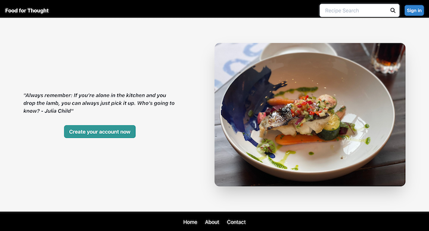
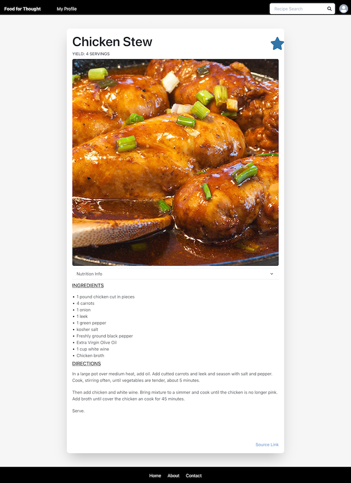
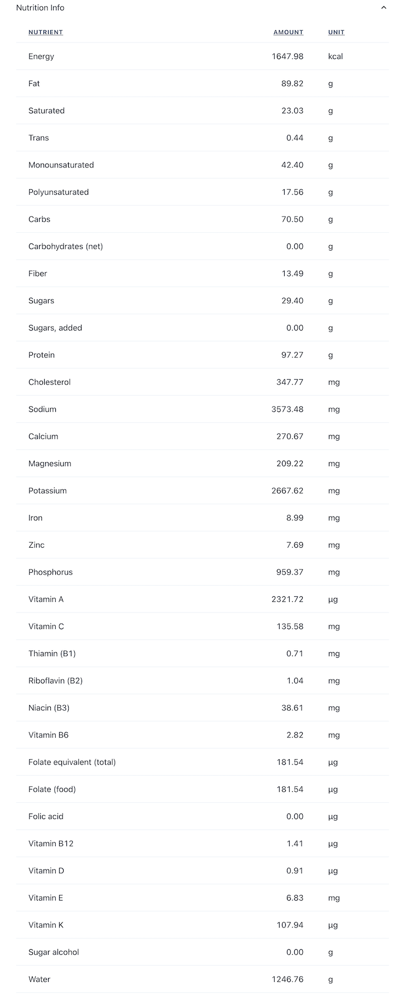

# Food for Thought

-----
## Table of Content

- [Description](#description)
- [Images](#images)
- [Site URL](#site-url)
- [GitHub Repository](#github-repository)
- [Authors](#authors)
- [Contributors](#contributors)  
- [Technologies Used](#technologies-used) 
- [License](#license)

-----
## Description:

Recipe site for a user to login, and search for recipes.  Recipe searching has advanced seach filters that allow seaches for:
- Diets:
    * Low Sodium
    * Low Card
    * Low Protein
    * Balanced
    * High Fiber
- Restrictions
    * Peanut Free
    * Kidney Friendly
    * and many others...
- Cuisine
    * Italian
    * Chinese
    * French
    * and many many others...

Once the user selects the recipe, from the search results, it loads and formats onto a recipe page.  The individual page allows you to favorite the recipe, and also displays all nutrient information.

-----
## Images:

### Initial Sign-on Page

  
----
### Recipe Search Results
  
----
### Individual Recipe
  
----
### Nutrient Information
  
----
### Profile Page with favorites
  

-----
## Site URL:

- [Food for Thought]('https://food-for-thought2.herokuapp.com/')

## GitHub Repository:

- [Github Repository for Food for Thought](https://github.com/ksjefferies/Food-for-Thought)

## Authors:

- [Kelly Jefferies](https://github.com/ksjefferies)
- [Victor Kennedy](https://github.com/Victorini1)
- [Alyssa Rodriguez](https://github.com/AlyssaRodri)
- [Stephen Elliott](https://github.com/UsernameisStephen)

## Contributors:

- Daniel Norred (Custom API for website recipe parsing)

-----
## Technologies Used:

https://recipied.io/

  

## License:

